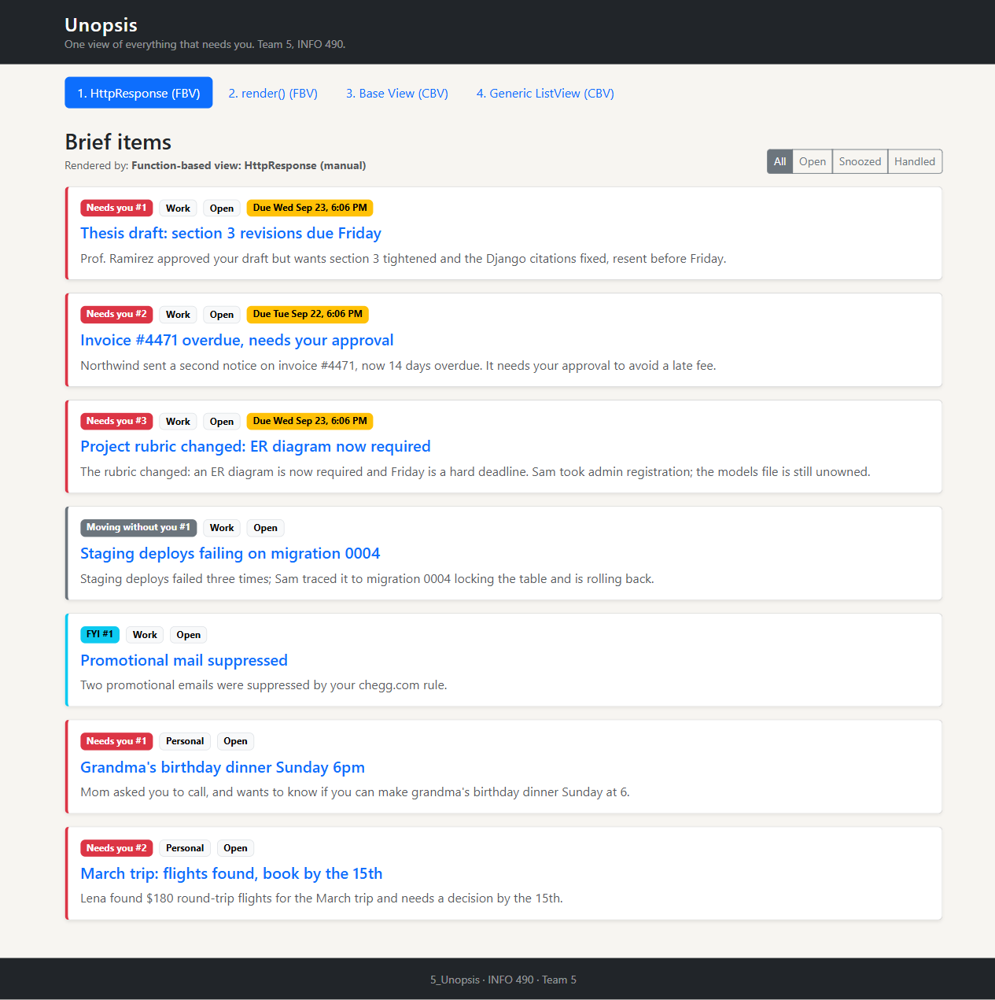
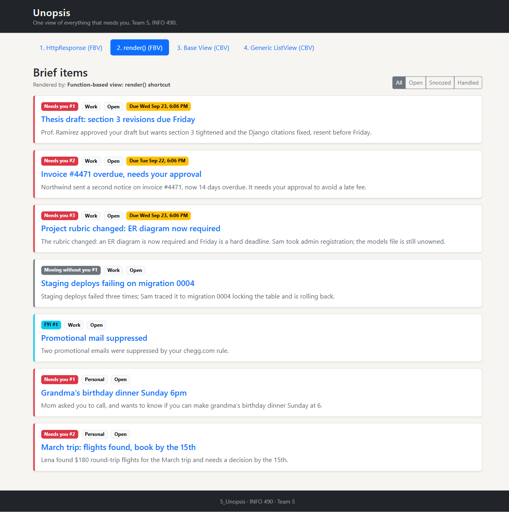
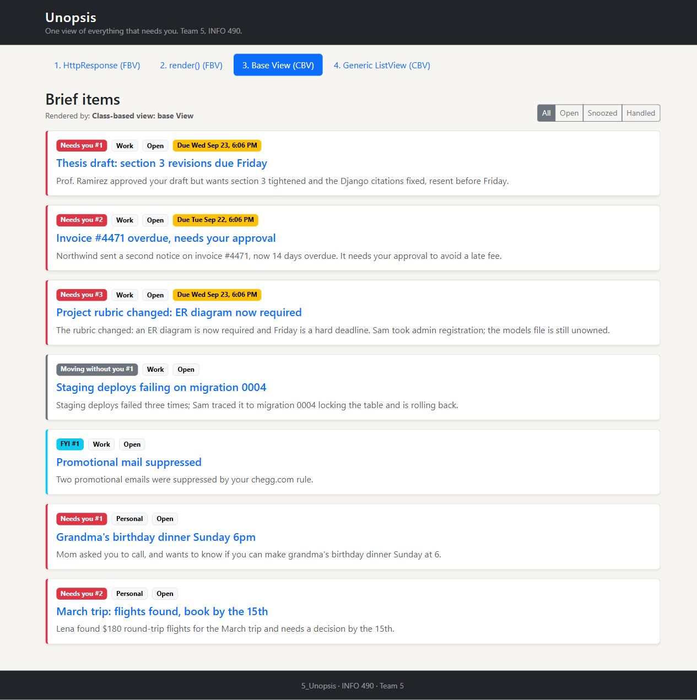
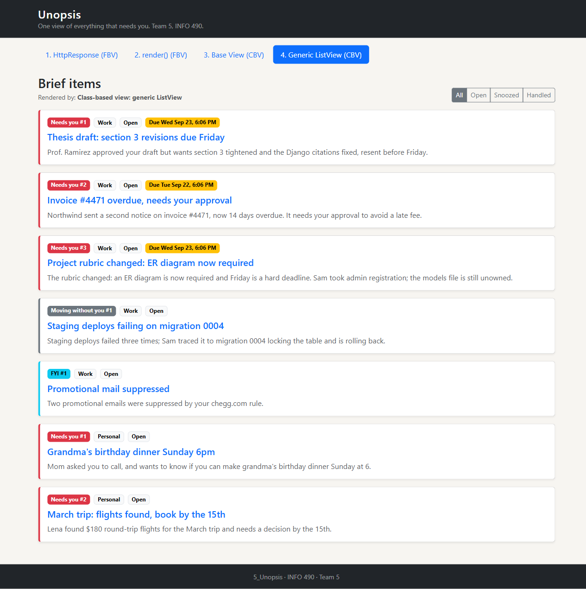
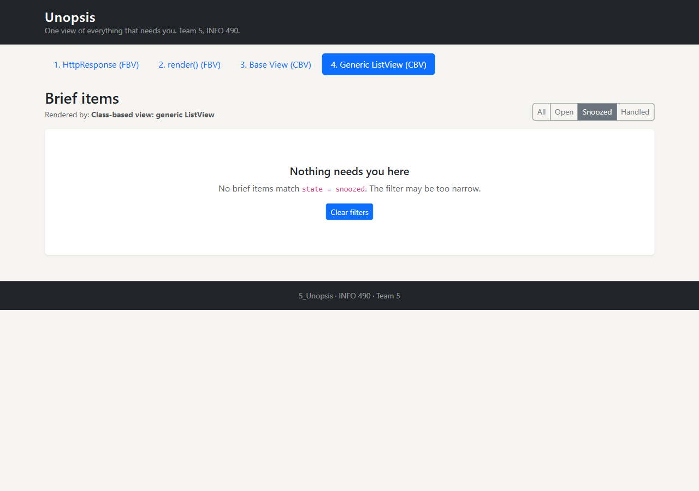
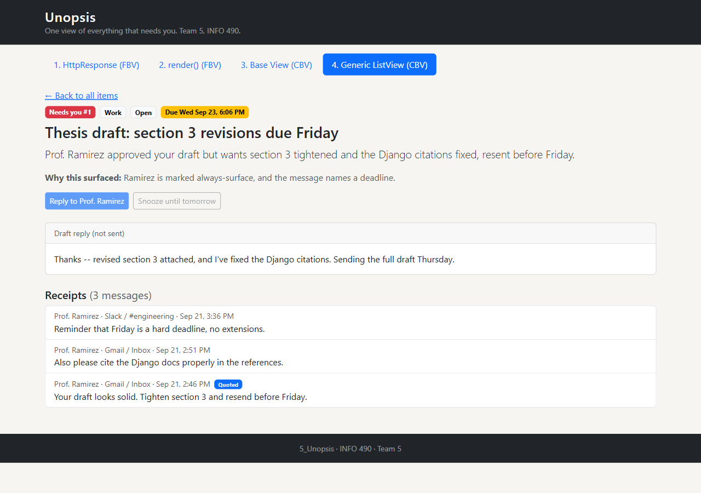

# 5_Unopsis

**Team 5, INFO 490.** Unopsis collects a person's notifications from every place they arrive
(Gmail, Outlook, Slack, Discord, WhatsApp, iMessage) and turns them into one short, ranked
"brief" in which every item can be traced back to the real messages behind it.

- Django project: `inboxtriage` (settings, URLs)
- Django app: `unopsis` (models, admin, views, templates)
- Design docs, wireframes, branching strategy and weekly notes live in [`docs/`](docs/)

---

## Setup

Requires **Python 3.11+**.

```bash
# 1. Create and activate a virtual environment
python -m venv .venv
.venv\Scripts\activate            # Windows
# source .venv/bin/activate       # Mac / Linux

# 2. Install dependencies
pip install -r requirements.txt

# 3. Create your local .env (it is git-ignored and never committed)
copy .env.example .env            # Windows
# cp .env.example .env            # Mac / Linux
#    then open .env and replace SECRET_KEY with a fresh value:
python -c "import secrets; print(secrets.token_urlsafe(50))"

# 4. Create the database and demo data
python manage.py migrate
python manage.py createsuperuser  # use username: mohitg2  (the demo data is owned by this user)
python manage.py seed_demo
```

## Running: development and production settings

Settings are split into `inboxtriage/settings/` (`base.py`, `development.py`, `production.py`).

| Mode | Command | `DEBUG` |
|---|---|---|
| **Development** (default for `manage.py`) | `python manage.py runserver` | `True` |
| **Production** | `python manage.py runserver --settings=inboxtriage.settings.production` | `False` |

Once the server is running, open http://127.0.0.1:8000/items/cbv-generic/ for the brief items
(all routes are listed under **Views and routes** below) or http://127.0.0.1:8000/admin/ for the admin.
The root address `/` has no page of its own, so Django shows a "page not found" list of valid routes in
development.

> With `DEBUG=False` Django's development server does not serve static files, so the admin
> looks unstyled in production mode. That is expected. For a quick local look add `--insecure`.

`wsgi.py` / `asgi.py` (used by real web servers) default to the production settings.

## Environment variables

Secrets are read from `.env` (see `.env.example` for every variable):

| Variable | Purpose |
|---|---|
| `SECRET_KEY` | Django's signing key. Required; the project refuses to start without it |
| `OPENAI_API_KEY` | Example third-party key (dummy value for now) |
| `ALLOWED_HOSTS` | Comma-separated hosts allowed in production |

## Views and routes

All views show the same model (`BriefItem`, one ranked card on a brief) in the four styles this
assignment asks for. Every route has a `name=`. The four list views render the same template.

| # | Kind | View (`unopsis/views.py`) | URL | Route name |
|---|---|---|---|---|
| 1 | Function-based, `HttpResponse` (manual) | `item_list_manual` | `/items/manual/` | `item-list-manual` |
| 2 | Function-based, `render()` | `item_list_render` | `/items/render/` | `item-list-render` |
| 3 | Class-based, base `View` | `ItemListBaseView` | `/items/cbv-base/` | `item-list-cbv-base` |
| 4 | Class-based, generic `ListView` | `ItemListView` | `/items/cbv-generic/` | `item-list-cbv-generic` |
| 4 | Class-based, generic `DetailView` | `ItemDetailView` | `/items/<id>/` | `item-detail` |

Templates: `templates/base.html` (blocks `title` and `content`), `templates/unopsis/briefitem_list.html`
(`` / ``) and `templates/unopsis/briefitem_detail.html`.

Add `?state=snoozed` to any list URL to see the empty state (no seeded item is snoozed).

## Tests

```bash
python manage.py test
```

Covers the named routes, the four list views, shared template inheritance, ordering, both empty
states, the detail page and a 404. Django uses a temporary database, so `db.sqlite3` is untouched.

## Screenshots

| | |
|---|---|
| **1. HttpResponse view** |  |
| **2. render() view** |  |
| **3. Base class-based view** |  |
| **4. Generic ListView** |  |
| **Empty state** (`?state=snoozed`) |  |
| **Detail page** |  |

The four view screenshots also show the normal list state.

## Documentation

| Folder | Contents |
|---|---|
| `docs/wireframes/v1/` | Wireframes from the previous assignment |
| `docs/branching_strategy/` | How this team uses Git branches (write-up and diagram) |
| `docs/notes/notes.txt` | Weekly progress, view inventory, reminders and challenges |
| `docs/screenshots/` | Browser screenshots of each view, the empty state and the detail page |
| `docs/design/` | Data-model design decisions (`DESIGN.md`), the ER diagram workbook, and the Part 4 README |
