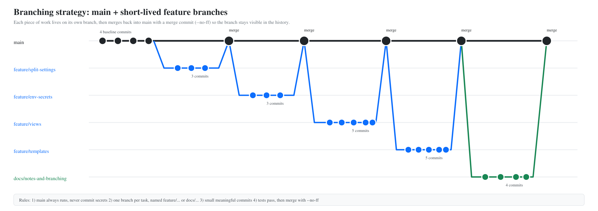

# Branching strategy



*(Source of the diagram: [`diagram.svg`](diagram.svg).)*

## The idea in one paragraph

`main` is the version of the project that always works. Nobody builds directly on it. Every piece
of work (a feature, a fix, a set of docs) gets its own short-lived branch, is committed in small
steps, and is merged back into `main` once it works. Because the merge is always recorded as its
own **merge commit** (`--no-ff`), the branch stays visible in the history instead of being flattened
into a straight line.

This is a simplified version of the Git-flow pattern shown in class (master / develop / feature /
release / hotfix). A team of our size does not need the develop, release or hotfix branches yet, so we
keep only `main` plus feature branches. If we ever deploy to real users, a `release` or `hotfix`
branch can be added without changing anything else.

## Branch types and names

| Branch | Purpose | Lives |
|---|---|---|
| `main` | Always runs. What the instructor and teammates pull. | Forever |
| `feature/<topic>` | One task that changes code (e.g. `feature/views`) | Until merged |
| `docs/<topic>` | Documentation, notes, screenshots only | Until merged |

Names are lowercase, use hyphens, and say *what* the branch is for, not *who* is working on it.

## The routine for every task

```bash
git switch main
git pull                                # get teammates' latest work first
git switch -c feature/<topic>           # 1. branch off

# ...make a small change...
git add <the files for that change>
git commit -m "Say what changed and why"   # 2. commit small and often

git push -u origin feature/<topic>      # 3. publish the branch

# 4. merge back, either way:
#    a) Pull Request on GitHub -> "Merge pull request" (create a merge commit), then:
git switch main && git pull
#    b) or locally:
git switch main
git merge --no-ff feature/<topic>
git push
```

## Rules

1. **`main` always runs.** Before merging: `python manage.py check` passes in development and
   production settings, and `python manage.py test` passes.
2. **Never commit secrets.** `.env` is git-ignored. Only `.env.example` (placeholders) is committed.
   Run `git status` before every commit and check nothing secret is staged.
3. **One task per branch.** A branch that does two unrelated things is hard to review and hard to undo.
4. **Small, meaningful commits.** A commit message should let a teammate understand the change
   without opening the diff ("Add render() function-based view", not "stuff").
5. **Pull before you start.** This avoids merge conflicts caused by working on an old `main`.
6. **Undoing safely.** `git restore <file>` discards uncommitted edits (careful, it cannot be undone).
   `git revert <commit>` undoes a commit by adding a new one (safe for shared history).
   Avoid rewriting history that teammates already have.

## How this project has used it so far

| Order | Branch | What it did | Commits |
|---|---|---|---|
| 1 | *(main baseline)* | `.gitignore`, `.env.example`, data model, admin, docs skeleton | 4 |
| 2 | `feature/split-settings` | `settings/` package with base, development and production | 3 |
| 3 | `feature/env-secrets` | `SECRET_KEY` and API keys moved into `.env` | 3 |
| 4 | `feature/views` | Four view kinds and their named URLs | 5 |
| 5 | `feature/templates` | `base.html`, list template with ``, detail template, tests | 5 |
| 6 | `docs/notes-and-branching` | Screenshots, this document, notes, README | 4 |

Run `git log --oneline --graph --all` to see the same picture from the real history.

## Working with teammates

- Each teammate clones the repo (`git clone <url>`), creates their own `.env` from `.env.example`,
  and works on their own branch under their own GitHub account, so the history shows who did what.
- Prefer merging into `main` through a Pull Request that another teammate has looked at.
- If two people need the same file, tell each other in `docs/notes/notes.txt` before starting.
